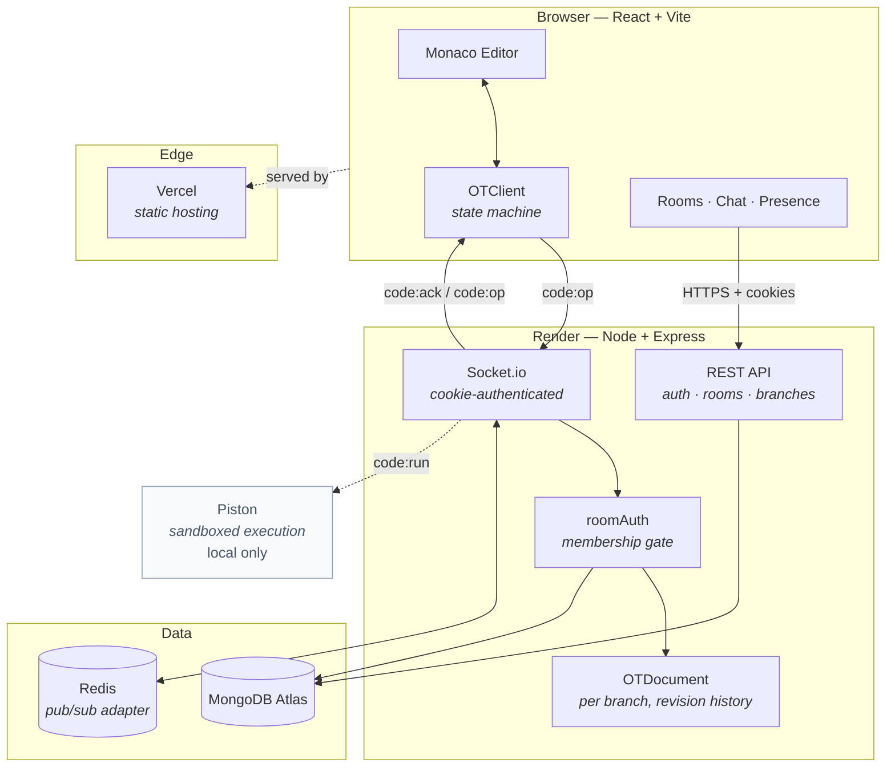
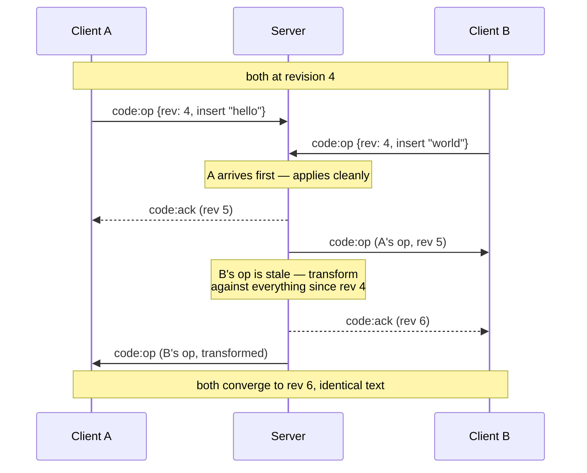
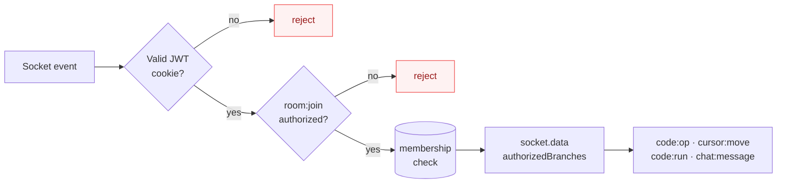

<div align="center">

# DevCollab

**A real-time collaborative code editor with Operational Transform, branch-scoped documents, and role-based rooms.**

[](https://dev-collab-hazel.vercel.app)
[](#testing)

[**Live Demo**](https://dev-collab-hazel.vercel.app) · [Architecture](#architecture) · [How OT Works](#how-operational-transform-works) · [Local Setup](#local-setup)

</div>

---

> [!NOTE]
> **The demo's first load takes a few seconds.** The API runs on a free Render instance that sleeps when idle. A scheduled ping keeps it warm most of the time, but a cold start still happens occasionally.
>
> **The "Run ▶" button is intentionally disabled in the demo** — it is greyed out with an *"Available soon"* tooltip, and this is deliberate rather than a bug. Code execution works fully in local development; see [Why code execution is disabled in the demo](#why-code-execution-is-disabled-in-the-demo) for the reasoning.

---

## What this is

Two people open the same document and type at the same time. Naive implementations lose characters, overwrite each other, or drift into different states. DevCollab implements **Operational Transform** — the algorithm behind Google Docs — so concurrent edits converge to an identical document on every client, without locking and without losing keystrokes.

Around that core sit the things a collaborative tool actually needs: branch-scoped documents, presence and live cursors, room membership with owner/admin roles, join requests, chat, and a security model that assumes clients are hostile.

### Features

| | |
|---|---|
| **Conflict-free editing** | Full Operational Transform implementation — `retain`/`insert`/`delete` primitives with `apply`, `invert`, `compose`, and `transform`; client-side state machine guaranteeing at most one in-flight operation |
| **Branch-scoped documents** | Rooms contain branches; each branch is an independent live document that can be forked from another, renamed, and switched between without cross-contamination |
| **Live presence & cursors** | Per-user colored cursors with inline username labels, plus a presence sidebar showing who is online |
| **Role-based rooms** | Owner / admin / member, with promote–demote, leave-room, and enforced ownership transfer so a room can never be orphaned |
| **Join requests** | Request access to a room you have no code for; owners and admins get a live, actionable accept/decline card anywhere in the app |
| **Room chat** | Persisted message history plus ephemeral system notices when someone joins |
| **Code execution** | Server-side sandboxed execution across 7 languages via a self-hosted Piston engine *(local only — [see below](#why-code-execution-is-disabled-in-the-demo))* |
| **Horizontal scaling** | Redis pub/sub adapter fanning Socket.io broadcasts across instances |

---

## Architecture



### Editing loop

Every keystroke becomes an operation, not a document snapshot. The client keeps at most one operation in flight and buffers the rest, so a slow network degrades into fewer, larger operations rather than a backlog or lost edits.



### Request authorization

A valid JWT alone is never sufficient. Room and branch IDs are guessable, so every socket event is checked against real database membership before it can read or mutate anything.



---

## How Operational Transform works

The hard part of collaborative editing is that two clients can edit the same text at the same moment, and neither knows about the other's change until it arrives — by which point their document has already moved on.

**The idea:** rather than sending "here is my document," each client sends *what it did* as an operation composed of `retain(n)`, `insert(str)`, and `delete(n)`. When an operation arrives that was written against an older revision, the server transforms it against everything it missed, producing an equivalent operation valid for the current state.

The correctness property that has to hold is **TP1**: given concurrent operations `a` and `b`, transforming them against each other must satisfy

```
apply(apply(doc, a), b′) === apply(apply(doc, b), a′)
```

Both clients apply the same two edits in opposite orders and must still land on identical text. This is verified by a **200-trial randomized convergence fuzz test** that generates random operations against random documents and asserts the property holds every time — the guarantee is not a claim in a comment, it is executable.

**Client state machine** (`client/src/ot/OTClient.js`) — three states: `synchronized`, `awaitingConfirm`, `awaitingWithBuffer`. Only one operation is ever in flight; further local edits compose into a single buffered operation, which is what makes fast typing on a slow connection behave gracefully instead of flooding the socket.

**Known and correct behavior:** two people typing at the exact same cursor position interleave characters. That is what Google Docs does in the same situation — it is the algorithm working, not a defect.

---

## Security

The project went through a deliberate hardening pass. Each item below was a real vulnerability that was found and fixed:

| Issue | Resolution |
|---|---|
| Any authenticated user could join **any** room by guessing its ID — socket events trusted a client-supplied room/branch ID with no membership check | Database-backed authorization gate on `room:join` / `chat:join`; every subsequent handler validates against `socket.data.authorizedBranches` |
| `GET /api/rooms/:id` silently auto-joined the requester as a member, bypassing join codes entirely | Returns 403 for non-members; access requires a join code or an accepted join request |
| NoSQL injection — `email`/`username` went straight into a Mongo `$or` query, so a JSON body could pass an operator object instead of a string | Explicit `typeof === 'string'` guards before the query |
| JWT in `localStorage`, readable by any injected script | Moved to an `httpOnly` cookie, with double-submit CSRF protection on all unsafe methods |
| No rate limiting — login, registration, and join codes were brute-forceable | `express-rate-limit` on auth and join endpoints, plus a per-user throttle on code execution |
| Wildcard CORS (`origin: '*'`) and no security headers | Origin restricted to a configured allowlist; `helmet` applied |
| Unbounded code payloads could be submitted for execution | Hard size cap |

**Cross-origin cookie handling** turned out to be the subtlest part of deploying this. Two bugs worth naming because neither reproduces locally:

- `document.cookie` cannot read a cookie set by a *different* origin, so the client could never see the CSRF token once the frontend and API were on separate domains. It worked in development purely because `localhost:5173` and `localhost:5000` share a hostname. The token is now delivered in the response body instead.
- Adding `Partitioned` (CHIPS) to the auth cookies **created a second cookie rather than replacing the first** — cookies are keyed by name *and* attributes. Browsers then sent both (`Cookie: csrfToken=<stale>; csrfToken=<current>`) and the parser exposed only the first, so every request from an affected browser failed CSRF validation. Fixed on both sides: the stale variant is now explicitly deleted, and validation matches against *every* value present.

---

## Tech Stack

**Frontend** — React 18 · Vite · Tailwind CSS · Monaco Editor · Socket.io-client · Axios · React Router

**Backend** — Node.js 20 · Express · Socket.io · Mongoose · JWT · bcryptjs · helmet · express-rate-limit

**Data** — MongoDB Atlas · Redis (Socket.io pub/sub adapter)

**Execution** — Self-hosted [Piston](https://github.com/engineer-man/piston) in Docker — JavaScript, TypeScript, Python, C++, Java, Go, Rust

**Testing** — Jest · Supertest · mongodb-memory-server · Playwright (end-to-end, real browsers)

**Deployment** — Vercel (client) · Render (API) · GitHub Actions (keep-alive)

---

## Project Structure

```
DevCollab/
├── client/                     React + Vite frontend
│   └── src/
│       ├── api/                Axios instance + endpoint wrappers
│       ├── components/
│       │   ├── auth/           Login / register
│       │   ├── chat/           Room chat panel
│       │   ├── editor/         Monaco wrapper, branch tabs, output panel
│       │   ├── landing/        Marketing page sections
│       │   ├── presence/       Member roster with role badges
│       │   ├── room/           Join requests, toasts, request-to-join
│       │   └── ui/             Shared primitives
│       ├── hooks/              useAuth, useSocket (app-level contexts)
│       ├── ot/                 TextOperation + OTClient state machine
│       └── pages/              Landing, Dashboard, Room
│
├── server/                     Node + Express backend
│   ├── src/
│   │   ├── config/             DB, Redis, CORS, auth cookies
│   │   ├── middleware/         JWT auth, CSRF, rate limiting
│   │   ├── models/             User, Room, Branch, Message, JoinRequest
│   │   ├── ot/                 TextOperation + OTDocument (revision history)
│   │   ├── routes/             Auth, rooms, branches, messages, join requests
│   │   ├── services/           Piston execution client
│   │   ├── sockets/            Auth gate, presence, editor, run, chat events
│   │   └── utils/              Room permission helpers
│   └── tests/                  15 suites, 152 tests
│
├── e2e/                        Playwright scripts driving real browsers
└── docker-compose.yml          Self-hosted Piston execution engine
```

---

## Local Setup

### Prerequisites

- Node.js 20+
- MongoDB (Atlas or local)
- Docker Desktop — *optional*, only for code execution
- Redis — *optional*, only for multi-instance scaling

### Installation

```bash
git clone https://github.com/MKD2004/DevCollab.git
cd DevCollab
```

**Server**

```bash
cd server
cp .env.example .env          # set MONGODB_URI and JWT_SECRET
npm install
npm run dev                   # → http://localhost:5000
```

**Client** — in a second terminal

```bash
cd client
cp .env.example .env          # set VITE_API_URL=http://localhost:5000
npm install
npm run dev                   # → http://localhost:5173
```

**Code execution** — optional, in a third terminal

```bash
docker compose up -d          # Piston on http://localhost:2000
```

Language runtimes are installed through Piston's `/api/v2/packages` endpoint rather than baked into the image, so each language needs installing once after the container starts.

### Environment Variables

**`server/.env`**

| Variable | Required | Notes |
|---|---|---|
| `MONGODB_URI` | yes | Connection string |
| `JWT_SECRET` | yes | Any long random string |
| `PORT` | no | Defaults to `5000` |
| `JWT_EXPIRES_IN` | no | Defaults to `7d` |
| `CLIENT_ORIGIN` | no | Comma-separated allowed origins; defaults to `http://localhost:5173`. **Must be set in production or CORS silently blocks the frontend** |
| `REDIS_URL` | no | Enables the pub/sub adapter. Managed Redis usually requires `rediss://` — plain `redis://` hangs with no useful error |
| `PISTON_URL` | no | Defaults to the local container |

**`client/.env`**

| Variable | Required | Notes |
|---|---|---|
| `VITE_API_URL` | yes | Backend URL |

---

## Testing

```bash
cd server
npm test
```

**152 tests across 15 suites**, using `mongodb-memory-server` — no live database required.

| Area | Coverage |
|---|---|
| **OT correctness** | `apply` / `invert` / `compose` behavior, revision handling, and a 200-trial randomized convergence fuzz test proving TP1 |
| **OT integration** | Real two-socket concurrent editing, forced resync on stale revisions, per-branch isolation |
| **Authorization** | Non-members rejected, forged branch IDs dropped, CSRF including duplicate-cookie shadowing |
| **Rooms & roles** | Promote/demote, leave, owner blocked from leaving without transfer, ownership actually moves |
| **Realtime** | Presence, cursors, chat, join notifications, run broadcasts, throttling, size caps |
| **Infrastructure** | Cookie attribute handling; real cross-process Redis pub/sub (auto-skips when `REDIS_URL` is unset) |

The `e2e/` directory holds Playwright scripts that drive multiple real browser contexts against a running stack — used to catch rendering and multi-user bugs that server-side tests pass straight through. They require a global Playwright install and a running frontend and backend.

---

## Why code execution is disabled in the demo

**This is deliberate. The feature is implemented, tested, and works locally.**

Execution runs on [Piston](https://github.com/engineer-man/piston), which sandboxes untrusted code using Linux cgroups and therefore needs a **privileged container**. Render, Vercel, and most managed platforms do not run privileged containers, so Piston cannot be deployed alongside the API — it needs a self-administered VPS.

That is a solvable problem, but it comes with one that matters more: **a publicly reachable code-execution endpoint gets found and abused for crypto mining.** Doing it properly means locking the endpoint to the API's origin and adding shared-secret authentication — real work, and not the kind worth rushing onto a public demo.

Rather than ship a button that visibly errors, it is disabled with an honest tooltip. Running the stack locally with `docker compose up -d` enables it fully, across all 7 supported languages.

The intended path when it returns: detect Piston's availability server-side and explain *why* it is unavailable, which also covers the case where it is configured but down — something the current build-time flag cannot.

---

## Deployment

| Component | Platform | Notes |
|---|---|---|
| Client | Vercel | Auto-deploys on push; SPA rewrite so client-side routes survive a refresh |
| API | Render | Free tier — sleeps when idle |
| Database | MongoDB Atlas | Free M0 |
| Keep-alive | GitHub Actions | Pings `/api/health` every 10 minutes |

The keep-alive is **best-effort, not a guarantee** — GitHub's scheduled workflows can run late under load, and GitHub disables cron on repositories inactive for 60 days.

---

## Roadmap

- [x] JWT auth, rooms, presence
- [x] Operational Transform — server, client, and full wiring
- [x] Live cursors with per-user identity
- [x] Branch model with per-branch documents
- [x] Room chat and join requests
- [x] Owner/admin roles, leave with ownership transfer
- [x] Redis pub/sub adapter
- [x] Security hardening pass
- [x] Deployment
- [ ] **Application state in Redis** — the adapter fans out broadcasts, but presence and document state are still per-process, so the system is not yet genuinely horizontally scalable
- [ ] **Hosted code execution** — see [above](#why-code-execution-is-disabled-in-the-demo)
- [ ] **CI** — nothing runs the test suite on push yet
- [ ] **Client-side tests** — all 152 tests are backend
- [ ] **Promote-branch-to-main** — a real merge would need commit history these live documents do not have; the honest scoped version is promotion, not a pull request

---

<div align="center">
<sub>Built by <a href="https://github.com/MKD2004">MKD2004</a></sub>
</div>
